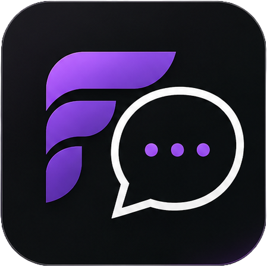

<p align="center">
  
</p>

<h1 align="center">Flair Messenger</h1>

<p align="center">
  A lightweight, portable Second Life instant-messaging client for Windows.
</p>

> [!IMPORTANT]
> This software is not provided or supported by Linden Lab, the makers of Second Life. Flair Messenger is an unofficial third-party project and is not affiliated with or endorsed by Linden Lab.

## Overview

Flair Messenger (FM) provides a focused way to access Second Life instant messaging without running a full graphical viewer. The interface is inspired by modern chat applications and keeps the most important communication tools together in one compact Windows desktop application.

The application connects directly to the official Second Life main grid through LibreMetaverse. It supports private conversations, group conversations, friends, notifications and local message history.

Current version: **0.4.14**

> [!WARNING]
> Flair Messenger does not currently support MFA/2FA login challenges. An account that requires a second factor during sign-in cannot complete login through this client. Do not disable MFA/2FA solely to use an experimental application. MFA/2FA support is a future goal, but it is not currently prioritized or scheduled while the application remains in development. See [ROADMAP.md](ROADMAP.md).

## Required third-party viewer disclosure

- **Software:** Flair Messenger 0.4.14.
- **Linden Lab status:** This software is not provided or supported by Linden Lab, the makers of Second Life.
- **Support:** Community assistance may be available through this repository's GitHub issues, but no customer support or response time is guaranteed. Linden Lab does not provide support for Flair Messenger.
- **Limitations:** Flair Messenger is a text-focused client and does not support MFA/2FA login challenges, the 3D world, voice, inventory, avatar rendering or many other features of the official viewer. Review [Known limitations](#known-limitations) before installation.
- **Privacy:** Read [PRIVACY.md](PRIVACY.md) before installation. Saved settings and history remain on the user's computer and are encrypted for the current Windows user.
- **Terms:** Use requires acceptance of Linden Lab's current Second Life terms and third-party viewer policies. Read [TERMS.md](TERMS.md) before installation.
- **Risk:** Use of Flair Messenger is entirely at the user's own risk.

## Features

- Sign in to the official Second Life main grid.
- Require acceptance of the current Second Life terms and third-party viewer policies before login.
- Use `Home` or `Last location` as the login destination.
- Accept account names in `First Last` or `first.last` format.
- Automatically use `Resident` for accounts without a last name.
- Optionally remember the login name, password and login location.
- Show an animated progress bar and live status while signing in.
- Use an integrated dark title bar with native-style window controls, dragging, maximizing and edge resizing.
- Receive and send private instant messages.
- Receive and send group instant messages.
- Route group and session messages by their Second Life chat-session ID instead of placing them under the sending avatar's private IM.
- Label recent conversations as `Group:` or `Private IM:` and show the conversation type in the chat header.
- Show only conversations with message activity during the last 24 hours in the recent Chats list.
- Ignore Second Life typing start/stop events while continuing to receive normal messages.
- Show a numbered unread-message badge on both the Windows taskbar icon and system-tray icon.
- Join the required Second Life group-chat session before sending the first group message.
- Display friends and their online status.
- Open a friend's private IM by double-clicking the friend or pressing Enter.
- Explicitly request the Second Life buddy list at login and resolve friend names after connecting.
- Automatically retry friend loading and provide a manual **Refresh** button on the Friends page.
- Display the avatar's current groups.
- Open a group chat by double-clicking the group or pressing Enter.
- Retrieve offline instant messages after login.
- Keep locally encrypted chat history between sessions.
- Collect in-app notifications for the current session.
- Minimize to the Windows system tray.
- Sign the avatar out before the application closes.
- Run from a movable folder without an installer.
- Start through a simple BAT launcher.

## Screens and navigation

The left navigation rail contains the following pages:

- **Chats** - Opens private, group and system conversations.
- **Friends** - Lists friends and shows whether they are online or offline. Double-click a friend to open a conversation.
- **Groups** - Lists current groups. Double-click a group to open its conversation.
- **Notifications** - Shows notifications generated during the current session.
- **Settings** - Displays the active account and basic storage information.
- **About** - Displays application and version information.

## System requirements

### Running the packaged release

- A modern Windows installation.
- The [.NET 8 Desktop Runtime](https://dotnet.microsoft.com/download/dotnet/8.0).
- An active Second Life account whose login does not require an MFA/2FA challenge.
- An internet connection that can reach the Second Life login and messaging services.

### Building from source

- The [.NET 8 SDK](https://dotnet.microsoft.com/download/dotnet/8.0).
- Windows, because the user interface uses Windows Forms.

## Installation

1. Download the latest release ZIP.
2. Extract the complete ZIP to a normal folder. Do not run it from inside the ZIP preview.
3. Keep the included folder structure intact.
4. Double-click `Start-FlairMessenger.bat`.
5. The launcher briefly displays `Starting app, one moment...` and then opens the login screen.
6. Review the official policy links and select the acceptance checkbox before signing in.

No installer is required. The extracted application folder can be moved to another writable location.

## Signing in

Enter the following information on the login screen:

- **Login name** - Use `First Last`, `first.last` or a single account name. A single name automatically receives the last name `Resident`.
- **Password** - The password belonging to the Second Life account.
- **Login location** - Select `Home` or `Last location`.
- **Remember details** - Saves the entered login details locally for the next session.
- **Terms acceptance** - Confirms that the user accepts the current Second Life terms and policies. This confirmation is required again whenever Flair Messenger is started.

After selecting **Login**, the button is disabled and an animated progress bar displays the current connection stage. Flair Messenger requests offline instant messages and group information after a successful login.

### MFA/2FA limitation

Flair Messenger cannot currently complete a login flow that asks for a multi-factor or two-factor authentication code. Accounts that receive such a challenge must use a supported Second Life client instead. The application does not bypass MFA/2FA, and users should not weaken their account security merely to use Flair Messenger.

MFA/2FA support is included as a future objective in [ROADMAP.md](ROADMAP.md). It has no promised release date and is not a current development priority while the client is still under active development.

## Using conversations

### Private messages

1. Open **Friends**.
2. Double-click a friend.
3. Enter a message in the field at the bottom of the chat.
4. Select **Send** or press Enter.

### Group messages

1. Open **Groups**.
2. Double-click a group.
3. Enter a message in the field at the bottom of the chat.
4. Select **Send** or press Enter.

Before the first message is sent, the Send button displays **Joining...** while Flair Messenger opens the required Second Life group-chat session. Later messages reuse that session. If Second Life refuses or times out, the reason is displayed inside the group conversation and the typed message remains available for another attempt.

Incoming conversations are added to the chat list automatically. The recent Chats list shows only conversations containing a real message from the last 24 hours, ordered by latest activity. It no longer fills itself with every friend, every group or every conversation ever stored. A friend or group deliberately opened from its own page remains available while it is active.

Older local message history remains encrypted in `data/messages.dat`; filtering the recent list does not delete it. If an older contact sends a new message, that conversation becomes recent again. System and connection messages appear in the **System** conversation.

Every recent conversation is explicitly labelled **Group:** or **Private IM:**. The chat header repeats the conversation type, and the Notifications page includes both the sender and the group or private-message context. A group member's message is stored under the group's session conversation, never under that member's private IM.

Messages already saved by a version before 0.4.13 cannot always be reassigned automatically because the incorrectly stored record no longer contains its original group-session ID. These older records age out of the recent list after 24 hours. To remove them immediately, close Flair Messenger and delete `data/messages.dat`; this also permanently removes all locally saved chat history.

## Minimize, exit and logout

Minimizing the main window hides Flair Messenger in the Windows system tray. The Second Life session remains connected so the application can continue receiving messages.

To restore the application, double-click its tray icon or use **Open Flair Messenger** from the tray menu.

To close the application, use the window close button or select **Exit** from the tray menu. Flair Messenger then:

1. Displays a dedicated `Signing out of Second Life...` window with an animated progress bar.
2. Requests the official Second Life logout handshake.
3. Waits for logout to finish.
4. Uses a blocking network shutdown fallback if the graceful request fails or times out.
5. Closes the application only after the logout process has completed.

Ending the process through Task Manager or forcibly shutting down Windows cannot guarantee a graceful logout.

## Local data and privacy

Flair Messenger creates a `data` folder next to `Start-FlairMessenger.bat` when it first needs to store information.

| File | Purpose | Protection |
| --- | --- | --- |
| `data/settings.dat` | Remembered login name, password, location and preference | The complete file is encrypted with Windows DPAPI for the current Windows user |
| `data/messages.dat` | Local conversation history | The complete file is encrypted with Windows DPAPI for the current Windows user |
| `data/launcher.log` | Output and errors from the hidden launcher process | Plain text |

Important privacy notes:

- Close Flair Messenger before copying or deleting the `data` folder.
- Delete the entire `data` folder before sharing an existing application folder.
- Flair Messenger recreates an empty `data` folder automatically.
- DPAPI-protected files are tied to the current Windows user and should still never be distributed.
- Version 0.4.0 automatically migrates legacy `settings.json` and `messages.json` files to encrypted `.dat` files. A legacy file is deleted only after its encrypted replacement has been written successfully.
- The official release ZIP should never contain the `data` folder.

Flair Messenger contains no analytics, advertising, telemetry, crash reporting or automatic update checks. Network communication is performed by LibreMetaverse and is used only for the Second Life login and messaging session. See [PRIVACY.md](PRIVACY.md) for the complete privacy documentation.

## Folder structure

```text
Flair-Messenger/
|-- README.md
|-- LICENSE
|-- PRIVACY.md
|-- ROADMAP.md
|-- SECURITY.md
|-- TERMS.md
|-- Start-FlairMessenger.bat
|-- Start-FlairMessenger.vbs
|-- app/
|   |-- FlairMessenger.dll
|   |-- FlairMessenger.runtimeconfig.json
|   |-- LibreMetaverse.dll
|   |-- assets/
|   |-- linden/
|   `-- other runtime dependencies
|-- assets/
|   `-- fmicon.png
|-- src/
|   `-- FlairMessenger/
|       |-- FlairMessenger.csproj
|       `-- Program.cs
`-- data/                         created locally; do not commit or distribute
```

The files in `app/linden` are runtime assets supplied through LibreMetaverse. Do not remove them from a packaged release.

## How the launcher works

`Start-FlairMessenger.bat` displays the startup message and starts `Start-FlairMessenger.vbs`.

The VBS launcher:

1. Determines the application folder automatically.
2. Creates the local `data` folder when necessary.
3. Sets `FLAIR_MESSENGER_HOME` so settings and messages remain beside the launcher.
4. Starts `app/FlairMessenger.dll` through `dotnet` without leaving a command window open.
5. Falls back to `dotnet run` and the source project when the compiled app is unavailable.
6. Writes startup output to `data/launcher.log`.

The fallback requires the full .NET 8 SDK. The normal packaged release only requires the .NET 8 Desktop Runtime.

## Build from source

Run the following commands from the repository root:

```powershell
dotnet restore .\src\FlairMessenger\FlairMessenger.csproj
dotnet build .\src\FlairMessenger\FlairMessenger.csproj -c Release
dotnet run --project .\src\FlairMessenger\FlairMessenger.csproj -c Release
```

To create the framework-dependent `app` folder used by the launcher:

```powershell
dotnet publish .\src\FlairMessenger\FlairMessenger.csproj `
  -c Release `
  -p:UseAppHost=false `
  -o .\app
```

`UseAppHost=false` keeps the packaged application DLL-based. The launcher starts it with `dotnet`, so a separate application EXE is not required.

## Creating a clean release

Before creating a release ZIP:

1. Close Flair Messenger.
2. Confirm that the build succeeds without warnings or errors.
3. Publish the latest source into `app`.
4. Remove or exclude the complete `data` folder.
5. Exclude development output such as `src/**/bin` and `src/**/obj`.
6. Confirm that `README.md`, the launcher files, `assets`, `app` and `src` are present.
7. Test the ZIP after extracting it into a new folder.

For a source-focused GitHub repository, consider excluding `app` from normal commits and attaching the compiled folder only to GitHub Releases. If `app` is committed, remember that it contains third-party binaries and assets with their own license terms.

## Troubleshooting

### Nothing happens after starting the BAT file

- Make sure the ZIP was fully extracted.
- Install the .NET 8 Desktop Runtime.
- Check `data/launcher.log` for the startup error.
- Open a terminal and run `dotnet --info` to confirm that .NET is available.
- Keep `Start-FlairMessenger.bat`, `Start-FlairMessenger.vbs` and the `app` folder together.

### The login fails

- Confirm the account name and password in the official Second Life viewer.
- Try both `First Last` and `first.last` name formats.
- Use a single name only for accounts whose last name is `Resident`.
- Check the internet connection and firewall settings.
- Check whether Second Life login services are available.

### The progress bar keeps moving

Login and offline-message retrieval depend on external Second Life services. Wait briefly, then close and restart Flair Messenger if the service does not respond. Review `data/launcher.log` when the application closes unexpectedly.

### Friends do not appear immediately

Open **Friends** and allow the service a few seconds to finish resolving names. Flair Messenger automatically retries the initial request. Select **Refresh** on the Friends page to request the list and names again without signing out.

If the list remains empty, confirm in the official Second Life viewer that the account has friends and that the Second Life service is available. Do not send the contents of the `data` folder when reporting the problem.

### Groups do not appear immediately

Group information is loaded after login. Allow the service a moment to respond. Signing out and signing in again can refresh the session.

### A group message is not sent

- Wait while the Send button displays **Joining...**; opening a group-chat session can take several seconds.
- Confirm that group chat is enabled for that group and available to your role/account.
- If the join request fails or times out, Flair Messenger displays the reason inside the group conversation.
- Check whether group chat works for the same account in the official Second Life viewer.

### Saved details or messages should be removed

Close Flair Messenger and delete the complete `data` folder. A new empty folder is created the next time the application starts.

### The application minimizes instead of disappearing

This is expected. Minimizing sends Flair Messenger to the system tray so it can remain connected. Use **Exit** from the tray menu to sign out and close it.

## Known limitations

- Windows only.
- MFA/2FA login challenges are not supported. Accounts that require a second factor cannot currently sign in through Flair Messenger.
- Connects to the official Second Life main grid; custom grid selection is not exposed in the interface.
- Messaging focused: no 3D world view, voice, inventory browser or avatar rendering.
- Encrypted settings and history are tied to one Windows user account and cannot be moved reliably to another Windows account.
- Notifications are kept only for the current running session.
- No automatic updater.
- No installer or digital code signature.
- A forced process termination cannot perform the logout handshake.

## Technology

- C#
- .NET 8
- Windows Forms
- [LibreMetaverse 3.1.3](https://github.com/cinderblocks/libremetaverse)
- JSON-based local storage
- Windows Data Protection API for remembered passwords

## Version history

### 0.4.14

- Fixed a Friends refresh race that could replace Chats immediately after a friend was opened.
- Made double-click reliably open the selected friend as a private IM.
- Verified and hardened the same double-click behavior for Groups.
- Added Enter as a keyboard alternative for opening a selected friend or group.
- Preserves the actual friend or group name separately from its online or member-count display text.
- Shows the current version directly in the integrated window title bar.

### 0.4.13

- Fixed group `SessionSend` messages being mistaken for private IMs when the `GroupIM` flag alone was insufficient.
- Uses LibreMetaverse's known group-session state as an additional routing signal.
- Routes every identified group message to a `group:` conversation keyed by its chat-session ID.
- Labels the conversation list with **Group:** and **Private IM:** source prefixes.
- Shows **Group chat** or **Private instant message** in the active chat header.
- Includes the sender and conversation source in Notifications.

### 0.4.12

- Limited the recent Chats list to conversations with message activity during the last 24 hours.
- Stopped automatically adding every friend, group and historical contact to the Chats list.
- Keeps a friend or group visible when the user deliberately opens it to start a new conversation.
- Preserves encrypted older history without allowing it to make inactive conversations look recent.

### 0.4.11

- Documented that MFA/2FA login challenges are not currently supported.
- Added a security warning advising users not to disable MFA/2FA solely to use the client.
- Added `ROADMAP.md` with directional plans for authentication, messaging, privacy, user experience and release engineering.

### 0.4.10

- Added a numbered unread-message badge to the Windows taskbar icon.
- Uses the same unread badge on the system-tray icon while the client is minimized.
- Counts only real incoming messages; typing protocol events never increase the badge.
- Clears the badge when Chats is opened, an unread conversation is deliberately selected or **Mark all as read** is chosen from the tray menu.

### 0.4.9

- Filters Second Life `StartTyping` and `StopTyping` protocol events before notification, storage and display.
- Keeps all normal private and group instant messages unchanged.
- Removes legacy incoming `typing` artifacts from encrypted local chat history while preserving messages sent by the user.

### 0.4.8

- Loads the original transparent PNG directly in the integrated title bar.
- Fixed the white triangular transparency artifact that could appear in the upper-left corner.
- Clones logo images and releases native icon handles so the asset file is never left locked.

### 0.4.7

- Replaced the white Windows title bar on the main client with an integrated dark Flair Messenger title bar.
- Added matching minimize, maximize/restore and close controls.
- Preserved title-bar dragging, double-click maximize and resizing from every window edge and corner.

### 0.4.6

- Tracks the currently visible page explicitly instead of relying on detached WinForms controls.
- Prevents group join, message and data refresh events from closing or replacing the active chat.
- Prevents a delayed friends refresh from pulling the user back to the Friends page.

### 0.4.5

- Opens and confirms the Second Life group-chat session before sending a group message.
- Reuses active group-chat sessions for later messages.
- Added a visible **Joining...** state while the group session opens.
- Reports group join failures and timeouts inside the selected group conversation.

### 0.4.4

- Added a dedicated visible logout window with an animated progress bar.
- Keeps the logout status visible until the Second Life logout handshake finishes or reaches its timeout.
- Prevents the logout window from being closed before the avatar session shutdown completes.

### 0.4.3

- Rebuilt the main window as separate navigation and content columns so pages no longer disappear behind the sidebar.
- Restored the complete conversation list beside the active chat.
- Reordered navigation into a natural top-to-bottom sequence below the app logo.
- Added a clear purple selected state for the active navigation tab.
- Standardized page headers, margins, lists and message-composer alignment.

### 0.4.2

- Explicitly requests the `buddy-list` login option.
- Requests avatar names for every returned friend in safe batches.
- Retries the initial friend load after login.
- Added a visible friend-loading status and a manual **Refresh** button.

### 0.4.1

- Added `TERMS.md` with Second Life policy links and an at-your-own-risk notice.
- Added a required terms-and-policy acceptance checkbox to the login screen.
- Added direct links to the official Second Life terms, Third-Party Viewer Policy and Linden Lab Privacy Policy.
- Added the disclosures required for a distributed third-party viewer.

### 0.4.0

- Added an MIT license for the original Flair Messenger source code.
- Added dedicated privacy and security documentation.
- Encrypted the complete saved settings file with Windows DPAPI.
- Encrypted the complete local chat-history file with Windows DPAPI.
- Added safe migration from legacy plaintext JSON storage.
- Confirmed that the source contains no analytics, telemetry, advertising or unrelated network endpoints.

### 0.3.4

- Added graceful asynchronous logout before closing.
- Added a blocking logout fallback when the graceful request fails.
- Suppressed misleading connection-loss notifications during intentional logout.

### 0.3.3

- Added an animated login progress bar.
- Added live connection status on the login screen.

### 0.3.2

- Converted all visible application text to English.
- Added a visible startup message to the BAT launcher.
- Updated the packaged launcher to prefer the compiled DLL.

### 0.3.1

- Fixed the `SplitterDistance` crash in the chat layout.
- Fixed the hidden login window keeping the process alive after the main window closed.

## Contributing

Contributions, bug reports and feature suggestions are welcome. When reporting a problem, include:

- The Flair Messenger version.
- The Windows version.
- The installed .NET version from `dotnet --info`.
- The relevant part of `data/launcher.log`.
- Clear steps for reproducing the problem.

Never attach files from the `data` folder to a public issue. Remove account names, avatar names, UUIDs and message contents from logs or screenshots before posting them. For security vulnerabilities, follow [SECURITY.md](SECURITY.md).

## Dependencies and acknowledgements

Flair Messenger uses [LibreMetaverse](https://github.com/cinderblocks/libremetaverse) 3.1.3 to communicate with Second Life. LibreMetaverse is distributed under the BSD 3-Clause license. The published application also contains LibreMetaverse dependencies and Linden runtime assets; those components retain their respective copyright and license terms.

The Linden asset notice included with the published application is located at `app/linden/cc-by-sa-3.0.txt`.

## License

The original Flair Messenger source code is available under the [MIT License](LICENSE).

Third-party libraries and assets are not covered by the Flair Messenger MIT License. They remain subject to their own license terms.

## Disclaimer

Use Flair Messenger entirely at your own risk. Keep your account credentials private, download releases only from a source you trust and review the source code before distributing modified builds. See [TERMS.md](TERMS.md) for the complete user notice and links to the official Second Life policies.
